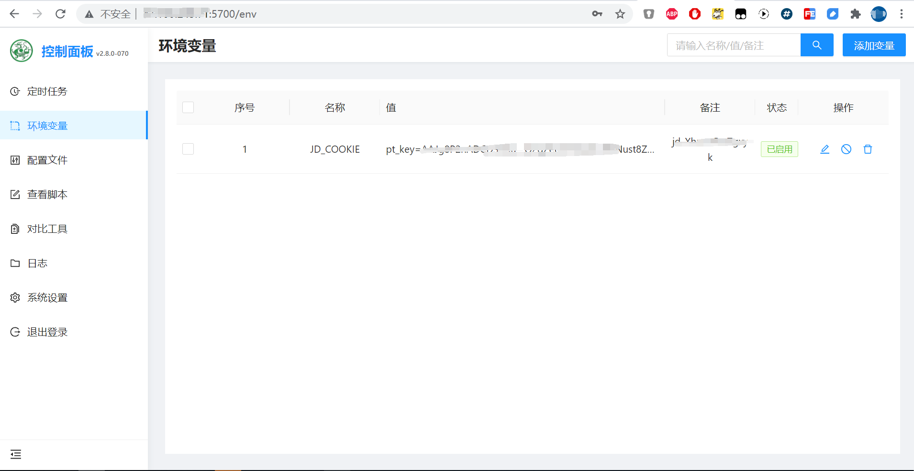
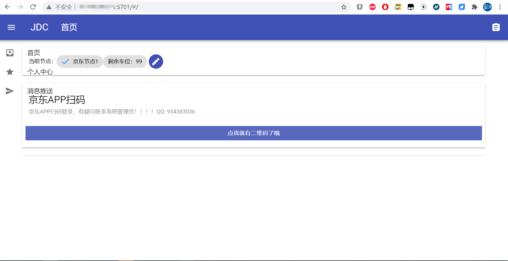

# qinglong-jdc
青龙面板2.8集成JDC

本库相关工具及技术仅供个人学习，研究使用，不得用于商业用途，否则后果自负！
请在下载24小时后删除

# dockerhub拉取镜像
```shell
docker pull yaonew/qinglong-jdc:latest
```
# 启动集成环境jdc随容器启动
```shell
$ docker run -dit \
  --name qinglong \
  --hostname ql \
  --restart always \
  -p 5700:5700 \
  -p 5701:5701 \
  -v /home/docker/ql/config:/ql/config \
  -v /home/docker/ql/log:/ql/log \
  -v /home/docker/ql/db:/ql/db \
  -v /home/docker/ql/scripts:/ql/scripts \
  -v /home/docker/ql/jbot:/ql/jbot \
  -v /home/docker/ql/jdc:/ql/jdc \
  yaonew/qinglong-jdc:latest
```
JDC会随容器启动，浏览器访问 http://ip:5700  http://ip:5701

# 构建qinglong-jdc集成环境镜像
当然你也可以通过拉取本库，构建自己的镜像
```shell
$ docker build -t crazyrico/qinglong-jdc:latest .
```





# Special thanks to:
排名不分先后
* [@whyour](https://github.com/whyour/)
* [@dadaxiaoxiaod](https://github.com/dadaxiaoxiaod/)
* [@shufflewzc](https://github.com/shufflewzc/)
* [@NobyDa](https://github.com/NobyDa)
* [@chavyleung](https://github.com/chavyleung)